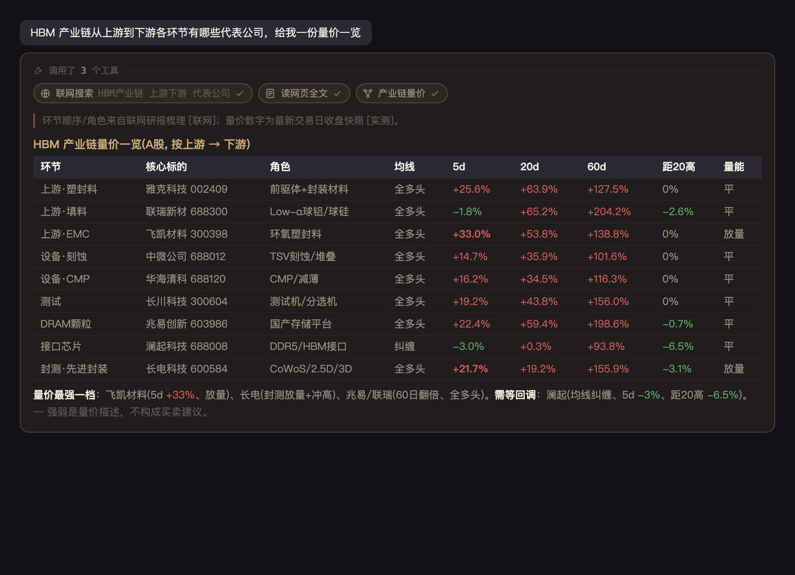
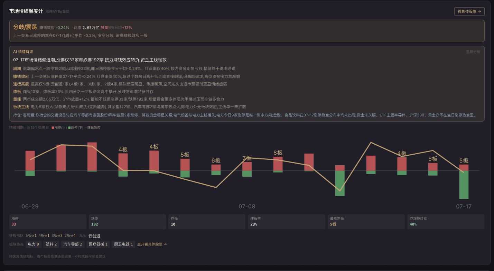
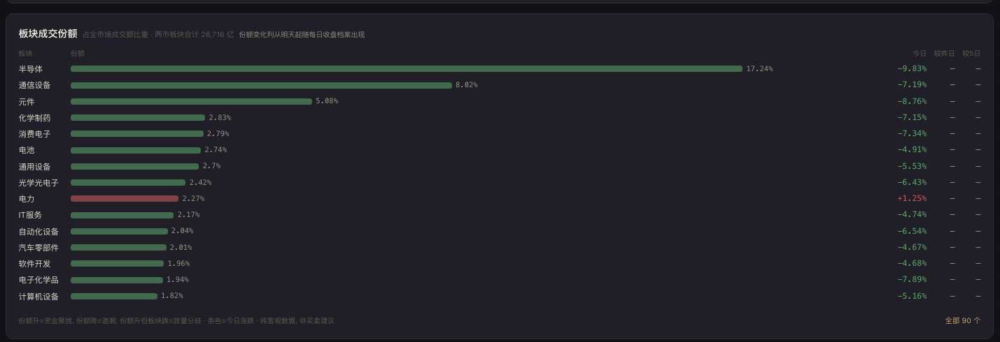
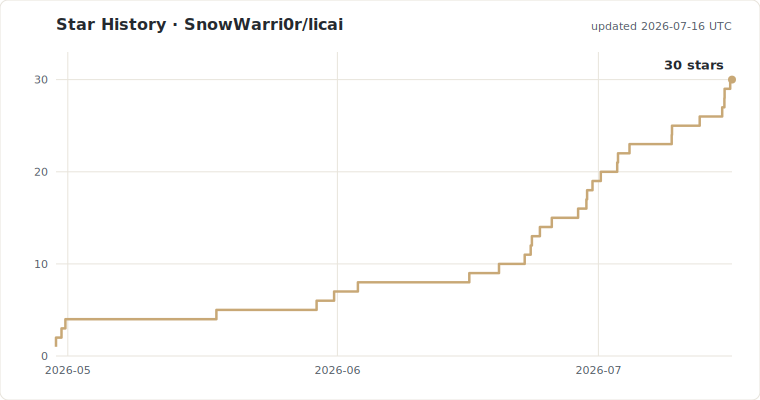

# 理财助手 · licai

> 一个本地化的**个人理财助手**——把 A股 / 基金 / 银行理财 / 现金账户 / 数字资产 / 量化机器人 全部装进一个看板，再叠加市场 AI 问答、个股详情页（K线/盘口/分时）、全市场涨跌幅/成交额榜单、板块对比、配置建议、早盘信息简报、资讯 AI 解读等决策辅助。**只给客观信息，不给买卖建议。**

**没有云端**、**没有账号**、**数据全部跑在你自己的机器上**。SQLite 单文件存储，你随时可以拷走、删掉、备份。


> 演示数据，运行 `python scripts/seed_demo.py --use` 一键重现。

## 为啥做这个

国内散户工具市场两极分化：
- 一头是券商 App / 银行 App，每家给你看自家的资产，**跨平台对账靠手算**
- 一头是 Excel + 雪球记账，**没有任何数据接入和决策辅助**

我自己的需求很简单：**把所有理财头寸装进一个屏幕，看清楚自己的钱在哪、配比合不合理、今天该不该动**。

## 🔍 问问市场 · 市场 AI 问答（独立页）

一个挂了 **35 个数据工具**的问答 agent，自由问个股涨跌 / 市场风格 / 资金主线 / 产业链 / 自己的成交，它自己决定调哪些工具取数据（并行调用），再客观解读——**只给客观信息，不给任何买卖建议**。流式打字机展示每一步在调什么工具，支持多轮追问（"它明天呢"会顺着上文标的继续）。

工具覆盖七个维度：

- **行情/走势** — 实时报价（含涨停/跌停/炸板/封板盘口判断）+ 近 N 日走势（A/港/美）。走势带**裸K量价**：每日开/收/高/低位置 + **量比** + **单根K线形态**（光头光脚阳/长上影十字…）+ **结构形态扫描**（头肩顶底 / 双顶 / 收敛三角 / 跳空缺口 / 量价背离 / **2B 假突破·假破位**）+ 多周期摘要（5d/20d/60d 涨幅、距20日高、均线排列）
- **资金面** — 主力资金流（超大/大/中/小单净额 + 近几日趋势）、**龙虎榜**（个股某上榜日的**买卖前五席位明细**：营业部名称/金额/占成交比 + 席位画像——机构/北向/知名席位名号/常见量化通道，回答"那天谁在买谁在砸"）、**席位追踪**（传名号"章盟主"或营业部名 → 该席位近90天上榜明细 + 净买后1/5日红盘率统计，回答"大佬说XX进场了帮我看看/这个席位胜率如何"）、**机构席位动向统计**（近30天机构净买入/净卖出榜 + 距上榜日至今涨跌——"机构接在山顶"还是"跑对了"一眼看穿）、同行横向对比、筹码面（十大流通股东 + 北向增减 + 解禁抛压）、打板情绪（涨停/连板/炸板 + **全市场涨跌家数**含沪/深/北分市场 + **涨跌分布直方图**——每1%一档，看下跌集中在哪个深度）、**板块动量矩阵（带量价配合判真上升趋势 vs 虚涨，趋势窗口 5/10/20 可调）**、热门概念榜、资金人气榜
- **业绩面** — 最新报告期**业绩预告看板**（预喜/预警榜 + 与你持仓的关联），个股问答时自动带业绩预告凭据
- **基本面/公司画像** — 营收/净利及同比、ROE/毛利率/净利率、PE/PB/总市值（**A/港/美**）；**公司画像**（主营业务 + 细分行业 + 主营构成 + 控股/实控背景，判国资/央企/中科院系/民营）；**客观红线清单**（监管处罚/退市/业绩预亏/商誉减值/问询/减持/解禁抛压扫描）
- **消息面** — 个股新闻（A/港/美）、结构化公告、政策面 + 全球宏观快讯（东财 + 财联社 + 同花顺 + 金十）、Anthropic 联网搜索 + **read_url 读网页全文**（搜到的研报/原文读全再下结论，免 key）
- **我的持仓** — 成交流水（个股 + 场内ETF + 场外基金，份额拆分自动折算）、综合成本 / 已实现盈亏 / **持有天数 + 开仓日（带星期）**、做T识别、**买入逻辑复盘（thesis）**、**全资产配置问答**（现金/理财框架 + 现状分析）、**ETF 题材透视**（问"我的 ETF 挂没挂羊头"直接出逐股贴题），按日期区间筛
- **产业链全景** — 问"X 产业链上游到下游" → 联网拿各环节代表公司 → **批量量价一览表**（环节 / 标的 / 角色 / 均线 / 5d / 60d / 距20高 / 量能），一眼看清整条链强弱分布



几条贯穿的"读盘原则"（来自实战反馈，固化进 agent）：

- **裸K量价为主轴，资金流只作线索** — 当下拆单 + 多子账户操作让"超大单=主力"的分档失真，所以以价格行为 + 量能为准，资金净流入只当参考，背离时点明
- **可信度分级 + 可溯源** — 关键数字标 `[实测]`（本地工具）/ `[联网]`（搜到的，带来源时间）/ `[待核实]`（仅记忆）；联网结论正文带**可点角标**，点击直跳原文核实，底部列完整来源
- **分清"正在发生"和"背景脉络"** — 几个月前的旧政策不冒充"这两天在炒"，行情数据周末锚定到最近交易日（不说成"今日"）
- **严格不输出操作建议** — 描述"市场在奖励动量"可以，绝不说"所以你该追"；方向性进出永远留给你自己定


## 核心能力

### 1. 全资产看板（UnifiedPortfolio）

六大类一站式：
- **A股** — 实时行情，含手续费综合成本（券商 App 口径）
- **基金** — 场内 ETF（实时市价）+ 场外公募（官方净值，跟主流基金平台对齐）；**份额拆分自动检测入账**（对比原始/前复权日K探测拆分因子，份额×N 单价÷N 零盈亏），盈亏用**摊薄成本口径**（减仓已实现摊进持仓成本，隔夜清仓重置，跟券商 App 逐分对齐）
- **理财** — 银行 T+30 锁定型，年化 + 起投日双向估算
- **现金** — T+0 货币基金 + 银行活期，单字段录余额，可选估月息
- **数字资产** — 交易所现货实时
- **机器人** — 交易所网格 / DCA 自动同步盈亏

附配套：
- 大类饼图 + 子分类小计（基金按"黄金/海外/A股宽基"等聚合）
- **集中度警告** + **同源风险检测**（A股有色 + 基金白银期货 = 同源）
- 加仓 4 模式：按股买 / 本金+净值 / 本金+份额 / 待确认（基金 T+1/T+2）


### 2. 板块雷达

每只 A股 vs **同花顺行业板块**实时对比（90 个细粒度板块自动匹配）：

```
铜陵有色 → 工业金属 | 60 日: 你 -9% / 板块 -7% → α -2% (跑输)
格林美   → 其他电源设备 | 60 日: 你 -7.5% / 板块 -1.2% → α -6% (跑输)
```

同页还有两件市场级参照：

- **情绪周期时间轴**（情绪温度计内）：近 30 交易日的 涨停(上柱)/跌停(下柱)/赚钱效应(折线)/最高连板高度 逐日序列——情绪处在冰点→回暖→高潮→退潮哪一段一眼可见；逐交易日收盘定格进 SQLite 档案，越攒越长
- **板块成交份额**：90 个行业占全市场成交额的比重排行 + 较昨日/5日的**份额迁移**——涨跌幅会骗人，成交占比往哪挪更接近资金真实走向（份额升但板块跌 = 放量分歧）；逐日收盘入档





### 3. 早盘 LLM 简报 + 收盘小结

**早盘简报**：每天 9:00 自动跑（也可手动触发）。基于每只持仓的近期新闻 + 公告 + K 线 + 基本面健康度，给一份**客观信息摘要 + 风险提示**——**不给任何操作建议**：
- `signal`：偏暖 / 中性 / 偏冷 / 警惕（只描述消息面倾向，不是买卖指令）
- 一句话点出今天最该知道的事 + 2-4 条客观要点（新闻/公告/基本面/技术位）
- 明确风险（业绩雷 / 监管 / 板块利空 / 股东减持 / 技术破位）单独标出
- 按个股真实行业拉对应板块新闻；**场内 ETF 也覆盖**（按主题词拉消息，侧重政策/资金/产业链）；飞书推送

**收盘小结**：交易日 15:10 自动生成（纯数据拼装，不走 LLM）——**全组合**今日浮动按贡献排序（A股 + 场内外基金 + 加密；场外基金净值滞后时用底层实时估并标注"按底层估"，估不出的单列说明不冒充）+ 事件区（持仓/自选上龙虎榜、涨停跌停、业绩预告当日披露）+ 大盘一行（涨跌家数/涨停跌停/情绪定性）。配了飞书推飞书；没配也一样用——**复盘页「今日」有同一份的站内卡片**，随时可看。

### 4. 配置建议（AllocationAdvisor）

3 套预设模板（保守 / 平衡 / 激进），显示**当前 vs 目标**配比 + 该加多少 / 该减多少：

| 模板 | 现金 | 理财 | A股 | 基金 | 加密 |
|---|---|---|---|---|---|
| 保守 | 15% | 50% | 12% | 23% | 0% |
| 平衡 | 8% | 30% | 28% | 29% | 5% |
| 激进 | 5% | 12% | 38% | 35% | 10% |

### 5. 基金代理标的（场外基金盘中预判）

天天基金 NAV 是 T+1 公布的，盘中估值不准——所以拉**真实 top10 持仓股的实时涨跌**加权算预判：

```
易方达全球成长 QDII (012922) → top10 持仓加权 -2.42% (覆盖 52% 净值)
  美 TSM 台积电   -3.12% × 8.88%
  美 LITE         -7.92% × 8.68%
  深 300502 新易盛 +0.66% × 6.02%
  ...
```

A股 / 港股 / 美股个股实时报价全部走 Sina 免费接口，无需 API key。


### 6. 全市场榜单（七个页签 + K 线浮层 + AI 抽屉）

左侧榜单 + 右侧 K 线，↑↓ 键翻股、←→ 切分类，想问再唤起 AI：

- **自选观察池**：在看但未必持有的票。任意榜单选中股票点右上 ☆ 加入（记下当时价格），自选页每行给 今日涨跌 / **自选以来涨跌** / **当下 K 线结构形态**（阶梯式上行 / 头肩顶 / 2B 假突破…每天看结构还完不完好）/ 业绩预告徽章
- **涨幅榜按"涨停占比"排**（涨幅 ÷ 该板块涨停幅度）：主板 10% 涨停与创业/科创 20% 涨停平起平坐，不会被 20% 板挤光主板
- **成交额榜**：看当日资金最集中的方向
- **龙虎榜**：最新披露日的**全部上榜个股**（按净买额排序，带东财解读/换手），点任意一只**直接弹开该日买卖前五席位浮层**——营业部名称、金额、占成交比 + 席位画像（机构 / 北向 / 知名席位名号 / 常见量化通道，名号表 `data/seat_names.json` 可自行维护）；**席位名可点**，弹出该营业部近 90 天上榜明细（股票/净额/上榜后1·5·10日涨跌）+ 净买后红盘率统计——"这个席位最近手风如何"有数可查
- **蓄势/强势（结构观察池）**：全市场龙头池（百亿市值 + 机构持仓 + 盈利）里两类"结构完好"的票，**按行业分组**展示（同行业强势多=主线在推进、蓄势多=可能在孕育）——**强势**=K线没砸下去（距60日高≤12%、近10日无大阴、上行结构未破位、不跑输沪深300）；**蓄势**=安静横盘基座（窄幅/缩量/横盘≥45日，规则闸过了再交 **AI 看图复核**）；每只带业绩预告凭据。纯结构描述，随时可能被砸
- **机构**：龙虎榜机构专用席位近30天买卖统计，主数字=现价较最近上榜日的涨跌——净买入+至今大跌即市场说的"机构接在山顶"
- **业绩**：最新报告期业绩预告 预喜/预警榜 + 持仓关联（直持或经由在持 ETF 前十大成分）

K 线本体是券商级可缩放蜡烛图（量 + MA5/10/20/30/60 + 昨收线 + 跳空缺口阴影），**点任意蜡烛出「分时›」提示，再点弹出浮层**：该日**分时图**（当日实时 + 历史分时，走通达信数据源）与**龙虎榜席位**两个页签；某日没上榜时直接列出这只票**最近的上榜日**，窗口内的一键跳转。任意一只点「问 AI」唤起对话抽屉，agent 自取数据后客观解读，跟"问问市场"同一套工具。


### 7. 风险提醒（客观警示，非操作信号）

- 单板块 > 50% / 70% 集中度警告
- 跨大类同源风险检测（A股有色 + 基金白银期货的隐藏共振）
- 基本面健康度红/黄灯
- 早盘简报里的风险项（业绩雷 / 监管 / 减持 / 技术破位）单独标出，飞书推送

> 注：早期的"实时价格条件单 / 解套提醒"模块已下线——实测下来，低吸/做T 类的提示性推送反复打脸，**客观看板 + 警示信息**才是真正有价值的部分，所以收敛到只做客观呈现、不做提示性信号。

### 8. 个股详情页（K线 + 盘口 + 分时）

任意 A股 / 场内 ETF 持仓点开看专业详情页：
- **多周期 K 线**（日/周/月）：蜡烛 + MA5/10/20 + 成本线 + 自己的买卖点（B/S 标记，精确到成交时刻，**除权/份额拆分自动折算到同标度**，拆分前的买入点照样贴在 K 线上）+ 可切换量 / MACD / KDJ 副图。K 线走**前复权**，除权/份额折算不再断崖
- **当日分时**：价 / 均价线 + 昨收基准 + 成交量按主动买卖着色（红买绿卖）+ 09:30 开盘点
- **五档盘口**（封单 / 内外盘，5s 刷新）+ **逐笔成交**（同价归并、大单高亮）
- 数据源可插拔（[通达信协议](https://github.com/SnowWarri0r/tdx-api)，不启用则自动回退）

成交记录还支持**精确到时分**录入、**每笔各记券商**（同一只票跨券商分别按各自费率算手续费）。

### 9. 资讯流 + AI 解读（五源合一）

- **全球宏观快讯 / 持仓个股新闻 / 市场要闻 / 商品产业 / 事件日历**五个来源一个页面切换，**重要**高亮、**关联我持仓**一键筛选（关联词覆盖场内 ETF 的主题，不只个股名）
- **事件日历**：持仓相关的未来已知事件时间轴——财报预约披露日 / 除权除息 / 解禁，覆盖 A股直持 + **场内 ETF 前十大成分股**（"寒武纪 8-08 披露中报，经由科创50ETF持有"这种提前量，不用等资讯里刷到）
- 任意一条点开出三段式 AI 解读：**讲了啥 / 为何重要 / 跟你持仓什么关系**——带你的全部持仓上下文（A股 + 基金 + 数字资产 + 机器人），**只解读不荐买卖**
- 原文抓取走 **DOM 级正文提取**（按段落密度定位正文容器，导航/页脚/推荐位噪声进不来），JS 渲染页自动回退远端渲染抓取

### 10. ETF 题材透视（避雷雷达）

用基金**季报真实成分股**对照名称宣称的主题，算"主题匹配权重"——专治"标榜红利/电器，实际重仓别的"的挂羊头 ETF：

- 逐股判定**只认行业不认名字**：股票名带"通信"但行业是消费电子，照样判偏题（名字挂羊头正是这个工具要抓的对象）
- 基金名自动分类四型：**行业主题**（算贴题% → 贴题 / 有偏离 / 偏离显著三档警示）、**宽基指数**、**风格策略**、**跨境商品债**（后三类天然多行业，只展示分布不打分）
- 主题比行业分类更细时（半导体设备 / 创新药）明确标注"只验证到大类"，100% 不给假安心
- 按主题查：输入"创新药" → 只对比该主题**规模最大的前 N 只**（小规模 ETF 流动性/清盘风险另算，不进对比池）
- 数据 = 基金季报（滞后至上季度末），纯客观结构展示


### 11. 复盘（今日 / 周 / 月 / 总览）

- **组合净值曲线（总览页）**：从流水 + 行情历史逐日重建组合市值，画 **TWR 时间加权收益**曲线（出入金已剥离，与基金净值同口径）对比沪深300 同起点归一——"我到底跑没跑赢大盘"一眼见分晓；带区间收益 / 最大回撤 / 超额收益，份额拆分自动折算同标度；**每日收盘快照**逐日定格真实市值，历史越走越准；AI 复盘直接引用这组 TWR 数字定性
- **持仓相关性矩阵**：在持标的两两日收益相关性 + 对沪深300——同源风险从"感觉像"变成数字（实测科创半导体 ETF × 半导体设备 ETF 相关性 0.99，等于一个仓）
- **今日组合归因**：全组合口径——A股 + 场内外基金 + 港美股 + 数字资产 + 机器人，谁在动、动多少、消息面有没有对应解释，一屏讲完；顶部**收盘小结卡片**与 15:10 飞书推送同一份数据（总浮动/分类小计/事件），没配飞书也随时可看
- 周期统计：胜率 / 盈亏比 / 平均持有天数 / 做T识别，**A股与基金 ETF 一并统计**（份额拆分不算买卖，不污染胜率）
- AI 复盘视角：按你的资金形态（固定资金 vs 复利增值）讲纪律一致性，只评过程不指方向


事件日历（资讯页第五源）：


## 技术栈

**后端**：FastAPI + SQLite + akshare + Sina API + 东方财富 API + 同花顺 API + Claude API（OAuth，含 tool-calling agent + SSE 流式）

**前端**：React + Vite + Tailwind CSS + PWA（可装到桌面）

**数据源**（全部公开免费）：
- A股 行情：Sina `hq.sinajs.cn`
- A股 历史 K 线 + 行业：Sina money.finance + EastMoney emweb
- 基金 NAV：天天基金（fund.eastmoney.com）
- 基金持仓：天天基金 fundf10
- ETF 题材透视：东财场内 ETF 列表 + 基金季报持仓（akshare）+ 全 A 行业快照
- 港股个股：Sina hk
- 美股个股：Sina gb_
- 商品期货 / 海外指数：Sina nf_ / hf_
- 行业板块：同花顺（akshare 内置）
- 数字资产：交易所公开 ticker
- 问问市场 agent：东财 个股资金流(fflow/kline) / 龙虎榜(全榜单+席位明细, akshare; 营业部历史明细走 datacenter dataapi) / 涨跌家数与涨跌分布(push2/push2ex) / F10 所属概念 / 财务摘要 / 港美股财务(em) / 板块成分 / 个股公告(np-anotice) / 业绩预告(akshare)
- 板块成交份额 / 情绪周期档案：同花顺板块汇总(akshare) / 东财涨停池系(akshare), 逐日定格进本地 SQLite
- 历史分时（K线浮层）：通达信协议（可选，[tdx-api](https://github.com/SnowWarri0r/tdx-api)）
- 网页全文（read_url）：Firecrawl 免 key `/v1/scrape` 主源 + Jina Reader（r.jina.ai）免 key 备用，配额用完自动切换
- LLM：Claude API（OAuth via Claude Code 或 ANTHROPIC_API_KEY），个股问答 agent 走 tool-calling + 服务端联网搜索 + 网页全文抓取

## 快速启动

```bash
git clone https://github.com/<your-name>/licai
cd licai

# Python 后端
python3 -m venv venv && source venv/bin/activate
pip install -r requirements.txt

# 复制配置模板
cp config.example.py config.py
# 按需修改: commission_rate (你的券商佣金率) / patience_years / index_annual_return

# 前端构建
cd frontend && npm install && npm run build && cd ..

# 启动
python run.py
# 访问 http://localhost:8888
```

第一次启动会自动建空 SQLite (`portfolio.db`) 在项目根目录。

### 演示模式（不录数据先看效果）

```bash
python scripts/seed_demo.py --use   # 备份你的 DB + 写入演示数据 (4 只 A股 + 11 笔外部资产)
# 重启服务器, 看演示效果

python scripts/seed_demo.py --restore   # 看完恢复真实 DB
```

也可以 `--peek` 只生成 `portfolio.demo.db` 不动当前 DB。

### 可选：飞书通知

设置 → 飞书 Webhook → 粘贴 URL 保存。所有告警（档位触发 / 基本面恶化 / 早盘简报）会推送过去。

### 可选：交易所自动同步

设置 → 交易所 → 填 API Key + Secret + Passphrase（建议**只勾"读取"权限**）。机器人和现货持仓会自动同步。

### 可选：LLM 早盘简报

需要 Claude API 凭证。两种方式：
1. **OAuth**：装好 Claude Code（CLI）登录，会自动从 macOS Keychain 读 OAuth token
2. **API key**：`export ANTHROPIC_API_KEY=sk-ant-...`

不配也能用，只是早盘简报功能停用。

## 项目结构

```
licai/
├── api/                  # FastAPI 路由
│   ├── portfolio_routes  # A股 持仓 / 历史交易
│   ├── assets_routes     # 外部资产 (基金/理财/现金/加密/机器人)
│   ├── briefing_routes   # 早盘简报
│   ├── sector_routes     # 板块雷达
│   ├── settings_routes   # 飞书 / 风控配置
│   ├── market_routes     # 市场指数 / 情绪 / 人气榜
│   ├── ask_routes        # 问问市场 agent 端点（SSE 流式 + 多轮）
│   └── ws.py             # WebSocket + 后台任务
├── services/
│   ├── stock_agent       # 问问市场 agent（34 个工具 + tool-calling loop + 裸K量价/结构形态/产业链/来源角标/read_url）
│   ├── portfolio_curve   # 组合净值曲线（TWR/回撤/相关性矩阵/每日快照预热）
│   ├── coiled_scanner    # 蓄势/强势结构扫描（规则闸 + AI 看图复核）
│   ├── lhb_detail        # 龙虎榜席位明细 + 每日全榜单 + 席位画像 + 席位追踪
│   ├── watchlist         # 自选观察池(行情+结构形态+业绩预告)
│   ├── sentiment_history # 情绪周期逐日档案(涨停/炸板/赚钱效应序列)
│   ├── sector_share      # 板块成交额份额 + 逐日档案(份额迁移)
│   ├── eod_summary       # 收盘持仓小结(全组合, 飞书+站内)
│   ├── inst_flow         # 机构席位动向统计
│   ├── earnings_board    # 业绩预告看板
│   ├── event_calendar    # 持仓事件日历（披露日/除权/解禁）
│   ├── market_data       # 行情接口 (Sina/EM)
│   ├── external_assets   # 基金 + 数字资产 + 期货 + 港美股 quote
│   ├── fund_proxy        # 基金代理标的（top10 持仓加权）
│   ├── fund_holdings     # 天天基金 top10 抓取
│   ├── sector_compare    # 同花顺板块对比
│   ├── etf_xray          # ETF 题材透视（季报成分 vs 宣称主题）
│   ├── morning_briefing  # LLM 早盘简报
│   ├── fundamental_score # 基本面健康度（期货 + 新闻 + LLM）
│   ├── position_ledger   # 综合成本法（含手续费/印花税/过户费）
│   ├── exchange_client   # 数字资产平台私有 API（机器人/现货同步）
│   ├── feishu_notify     # 飞书 webhook
│   ├── llm_client        # Claude API (OAuth + API key 双模式)
│   └── news              # 新闻抓取
├── frontend/             # React + Vite
├── config.example.py     # 配置模板
├── database.py           # SQLite + schema
├── run.py                # FastAPI entry
└── requirements.txt
```

## 定位与免责声明

- 本项目是**个人自用的只读资产看板**：所有功能限于展示与分析用户自有账户数据,不提供也永不添加任何交易执行、兑换、撮合、代客理财或推广引流(邀请码/返佣)功能。
- 数字资产模块仅通过**只读 API Key** 读取用户自有账户余额与历史(设计约束,详见 `services/okx_client.py` 模块头),服务端没有任何下单代码路径。
- 全部输出为客观信息整理与结构描述,**不构成投资建议**;数字资产在中国境内的相关业务活动属非法金融活动,个人投资风险自担(参见央行等八部门 2026 年通知),使用本工具不改变上述法律状态。

## 数据隐私

- **所有数据存本地 SQLite**，不上传任何云端
- 实时行情从公开接口拉，**不需要任何账号**
- 交易所 / LLM 凭证存数据库本地，飞书 webhook 也是
- `portfolio.db` 已在 `.gitignore` 里，不会被 commit
- 备份在 `backups/` 目录每天自动保留 30 天

## 已知限制

- **akshare** 依赖东方财富 API，部分接口（push2.eastmoney.com）会限流，已对这种情况做了 fallback（同花顺 + 硬编码 ETF 兜底）
- **LibreSSL 老版本** macOS 系统 Python 3.9 用 LibreSSL 2.8.3，跟某些 EM 接口 TLS 握手不稳，已用 subprocess curl 兜底
- 跑在国内非代理环境，海外接口（Claude API / 交易所）需要自行处理网络

## License

[GNU AGPL-3.0](./LICENSE)

为啥选 AGPL：这是个**完整应用**而不是库，AGPL 防止有人 fork 后包成 SaaS 卖钱不开源回馈。你 self-host 用 / 个人 fork 改造完全没限制。

## Contributing

欢迎 Issue / PR。因为是个人理财工具，特别欢迎：
- 你自己用着不爽的细节体验
- 新数据源接入（券商对账单导入 / 银行 OCR / 雪球同步）
- 投资组合分析新指标（夏普比率 / 最大回撤 / VaR）
- 国际化（目前只有中文 + A股/港股/美股；如果要做欧洲市场 PR welcome）

## Star History



> GitHub 2026 年 7 月起收紧了 stargazers 接口权限,star-history.com 的嵌图对非协作者失效——这张图由仓库内 [GitHub Action](.github/workflows/star-chart.yml) 每日自渲染,不依赖第三方服务。
